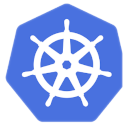
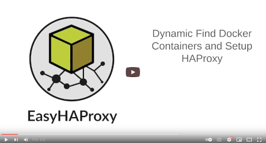
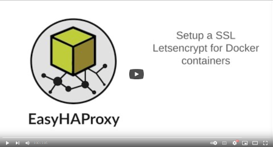

# EasyHAProxy

## Service discovery for HAProxy

EasyHAProxy dynamically creates the `haproxy.cfg` based on the labels defined in docker containers.

EasyHAProxy can detect and configure HAProxy automatically on the following platforms:

- Docker
- Docker Swarm
- Kubernetes

## Who is using?

EasyHAProxy is part of some projects:
- Dokku 
- MicroK8s

See detailed instructions on how to install below.

## Features

EasyHAProxy will discover the services based on the Docker Tags of the containers running on a Docker host or Docker Swarm cluster and dynamically set up the `haproxy.cfg`. Below, EasyHAProxy main features:

- Use Letsencrypt with HAProxy.
- Set your custom SSL certificates
- Balance traffic between multiple replicas
- Set SSL with three different levels of validations and according to the most recent definitions.
- Set up HAProxy to listen to TCP.
- Add redirects.
- Enable/disable Stats on port 1936 with a custom password.
- Enable/disable custom errors.

Also, it is possible to set up HAProxy from a simple Yaml file instead of creating `haproxy.cfg` file.

## How Does It Work?

You don't need to change your current infrastructure and don't need to learn the HAProxy configuration.

The steps are:

- Run the EasyHAProxy container;
- Add some labels to the containers you want to be parsed by EasyHAProxy (see detailed instructions below);
- EasyHAProxy will automatically detect the containers, set up, and reload the HAProxy configurations for you without downtime.

## Detailed Instructions

For detailed instructions on how to use EasyHAProxy, follow the instructions for the platform you want to use:

Or you can install using tools:

## See EasyHAProxy in action

Click on the image to see the videos (use HD for better visualization)

[Here is the code](https://gist.github.com/byjg/e125e478a0562190176d69ea795fd3d4) applied in the examples above.

----
[Open source ByJG](http://opensource.byjg.com)
